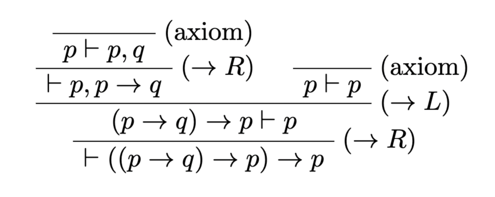

# LkProver
An automated LK deduction. The resulting proof is emitted as a Latex snippet that uses [`bussproofs`](https://www.logicmatters.net/resources/pdfs/latex/BussGuide2.pdf).

## Example
```sh
echo '|- ((p -> q) -> p) -> p' | dune exec bin/main.exe
```
```latex
\begin{prooftree}
\AxiomC{}
\RightLabel{(axiom)}
\UnaryInfC{$p \vdash p, q$}
\RightLabel{($\rightarrow R$)}
\UnaryInfC{$\vdash p, p \rightarrow q$}
\AxiomC{}
\RightLabel{(axiom)}
\UnaryInfC{$p \vdash p$}
\RightLabel{($\rightarrow L$)}
\BinaryInfC{$(p \rightarrow q) \rightarrow p \vdash p$}
\RightLabel{($\rightarrow R$)}
\UnaryInfC{$\vdash ((p \rightarrow q) \rightarrow p) \rightarrow p$}
\end{prooftree}
```


## Available Symbols
- variables : `[A-Za-z][A-Za-z0-9_]*`
- not : `¬`, `~`, `!`
- and : `∧`, `^`
- or : `∨`, `v`, `V`
- implication : `→`, `->`
- proves : `⇒`, `=>`, `⊢`, `|-`
- parentheses : `(`, `)`
